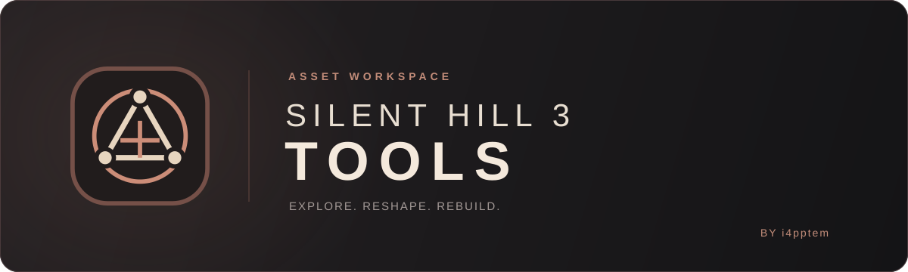
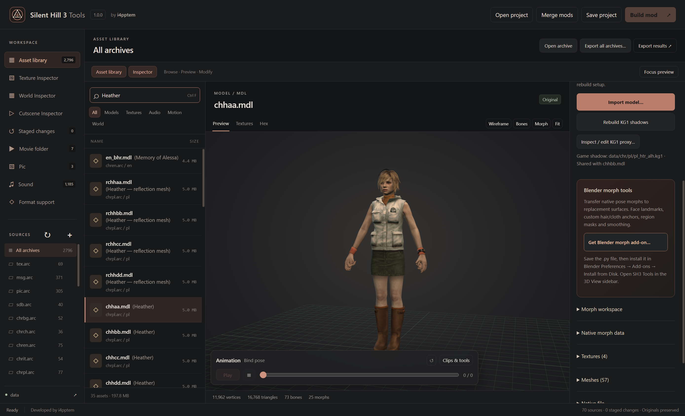

<p align="center">
  
</p>

<p align="center">One workspace for Silent Hill 3 PC modding.</p>
<p align="center">
  <a href="https://github.com/i4pptem/sh3r-tools/releases">Download</a> ·
  <a href="docs/INSTALL.md">Getting started</a> ·
  <a href="docs/WORKFLOWS.md">Workflows</a> ·
  <a href="docs/BLENDER-MORPH-TOOLS.md">Blender Morph Tools</a> ·
  <a href="docs/EXECUTABLE-PATCHES.md">Runtime patches</a> ·
  <a href="CREDITS.md">Credits</a>
</p>

**Silent Hill 3 Tools 1.0.0** brings archive browsing, asset previews, model and animation exchange, map editing and mod building into one Windows application. Open the game's `data` folder, inspect its resources, stage your changes and build a separate mod folder. Developed by **[i4pptem](https://github.com/i4pptem)**.

This is an independent modding project for the **PC version** of Silent Hill 3. It is separate from [Silent Hill 3 Remix](https://github.com/i4pptem/sh3r-rtx); RTX Remix is not required. The application interface is in English.

<p align="center"></p>

## Explore, edit and build

| Workspace | What you can do |
| --- | --- |
| **Asset Library** | Browse ARC/AFS archives, nested sound archives and the `movie`, `pic` and `sound` folders. Search native filenames and known character names. Export one asset, one archive or all archives as native files or supported common formats. |
| **Models and morphs** | Export GLB, FBX or `.blend`; import GLB, GLTF, FBX or `.blend` with base-color textures. Replace topology against the original rig, map shape keys to game morph slots, and compare the serialized replacement with the original before staging. |
| **Blender Morph Tools 1.3.2** | Transfer expressions to replacement meshes using paired landmarks, protected lip/eyelid regions, smoothing, local motion constraints and per-morph depth adjustments. Preview individual morphs before creating all keys. Hair and cloth templates are included. |
| **Animation** | Play ANM and cutscene skeletal/facial motion. Exchange ranges through Blender or FBX, bake evaluated IK/FK, ignore helper bones, and transfer between compatible banks. See writable channels per bone and verified Heather Action names/ranges. |
| **Texture Inspector** | Find standalone textures, embedded MDL/MAP images, font atlases and supported pictures together. Zoom, pan, export PNG and stage replacements. Shared map textures show their referencing maps. |
| **World Inspector** | Find MAPs by verified area and edit geometry, materials and textures. Exchange whole maps or individual parts, including new topology. Overlay and edit CLD/CAM, transform multiple selections, simplify bound collision and undo room edits together. |
| **Cutscene Inspector** | Play complete scenes with cameras, characters, morphs, environment, moving objects and sound. Export a scene to Blender and reimport its existing motion, morph, camera, light and prop channels. |
| **Sound, text and movies** | MES/JSON exchange, supported sound-bank/sample editing, WAV exchange, AIX handling and native PC FMV conversion. Edit normal/small font atlases, including supported 2×/4× coverage. |
| **Shadows and mod composition** | Rebuild or inspect/edit character KG1 proxies through GLB. Merge changes to different assets, review file conflicts, save projects and exchange portable mod packages. |
| **Build Mod** | Review changed assets, errors, warnings and required runtime patches. Build replacement game files or a compact DLL/ASI overlay that loads changed assets while retaining original files. |

Collapse the library or Inspector to enlarge the viewport. Animation and Room editor controls can be moved and resized. Map navigation uses WASD and X/C; E/R/T select move/rotate/scale, and Ctrl+Z undoes room edits. Long exports show progress inside the export dialog.

See [supported formats](docs/FORMATS.md) for the exact editing scope of each format. Unknown variants remain available for native export/replacement where supported.

## Get started

1. Download `Silent-Hill-3-Tools-1.0.0-win-x64.zip` from [Releases](https://github.com/i4pptem/sh3r-tools/releases) and extract the **entire folder**.
2. Run **Silent Hill 3 Tools.exe**. No Node.js installation is needed.
3. For movie/media conversion, close the app and run **Install media.cmd** once. It downloads and verifies the pinned FFmpeg build. Normal asset processing is local.
4. For FBX and `.blend` exchange, install **Blender 4.2+** separately; Blender 5.2.2 was used for validation. Set `SH3TOOLS_BLENDER` to `blender.exe` if detection does not find it.
5. Choose **Open data folder**, select the game's `data` directory, then browse and edit. Save a `.sh3project` to keep staged replacements and continue later.
6. Choose **Build mod**, review the changes and required patches, then select a delivery mode and separate output folder. Close the game before installing the generated mod.

**Install the bundled Blender add-on:** select a model with morphs and use **Blender Morph Tools → Get Blender morph add-on…**, or take `resources/app/tools/blender/sh3_morph_transfer.py` from the portable folder. Install that file from Blender's Add-ons preferences. Open **3D View → Sidebar → SH3 Tools → Pose Morph Transfer → 1. Meshes**. The add-on also works independently in Blender on macOS; the main application is Windows-only. [Complete morph workflow →](docs/BLENDER-MORPH-TOOLS.md)

[Installation and rollback](docs/INSTALL.md) · [Authoring workflows](docs/WORKFLOWS.md) · [Import and build review](docs/AUTHORING-REVIEW.md)

## Two ways to install a mod

**ASI overlay** builds contain `plugins/SH3Tools.dll`, a small `SH3ToolsLoader.asi` initializer and changed assets under `plugins/SH3Tools/data`. Ultimate ASI Loader starts the plugin. Original archives and the executable stay on disk unchanged; required patches apply in memory. ARC/AFS output contains changed entries, not complete source archives. Loose movie, picture and sound replacements are supported. The mode requires matching original archives and a supported original executable. [Overlay installation and compatibility →](docs/ASI-OVERLAY.md)

**Replace game files** builds write rebuilt archives/loose files and, only when needed, a patched executable into the output folder. Source files are preserved. Install the generated files together and retain paired backups for rollback.

Build Mod detects runtime requirements from the staged output; it does not apply every patch to every mod:

| Extension | Trigger |
| --- | --- |
| Model texture tables | More than six images, five primary texture runs or one secondary run |
| Morph scratch buffer | More than 1,536 pooled changing morph nodes |
| Primary GPU indices | More than 65,536 primary-group vertices |
| Secondary mesh storage | More than 1,024 vertices or 2,048 triangles in the secondary group |
| Picture streaming | A recognized `data/pic` TEX exceeds 1,361,920 bytes |
| Character storage | Effective character reservations/cache exceed the stock arena |
| Background/MAP storage | The complete staged world-resource budget exceeds stock primary storage |
| Transparent MAP queue | Transparent geometry grows or exceeds 2,730 triangles |
| High-resolution fonts | A font contains a supported 2×/4× coverage extension |

Only authenticated executable layouts are supported. Extensions increase specific storage or queue capacities; native format and GPU constraints remain. [Exact patch behavior, hashes and limits →](docs/EXECUTABLE-PATCHES.md)

## Scope of 1.0

- **Models retain the original skeleton.** Up to 32 image slots and 32 texture groups per mesh group are supported, with conditional runtime extensions beyond the original tables. PBR normal/metallic/roughness shading is not converted.
- **ANM banks retain their length and channel layout.** Use Fit to resample into an existing range. Missing position/rotation channels are reported; new keys cannot create them. The experimental Action-length extension is removed.
- **Cutscene exchange edits existing channels.** New actors/channels, scene duration changes, event scripts and full native lighting/effects are not supported. In the tested installation, 72 of 77 scenes resolve resources automatically; five need manual choices.
- **Map editing does not replace the level scripting system.** Triggers, room streaming and transitions are not authored. CAM study is a composition aid, not a complete gameplay-camera simulation.
- **KG1 is a rigid per-bone shadow proxy.** Rebuilding does not add blended shadow skinning or facial morph deformation; manual correction can be needed around faces and joints.
- **Mod merging operates per asset.** Different files in the same archive combine; two variants of the same MDL/MAP require choosing one file. Internal geometry/texture merging is not implemented.
- **Morph transfer needs artistic review.** The supplied Heather face workflow has user confirmation, but unrelated anatomy, hair and cloth still need their own checks. Test authored replacements in gameplay and cutscenes.

[Validation evidence](docs/VALIDATION.md) · [Troubleshooting](docs/TROUBLESHOOTING.md) · [Post-1.0 roadmap](docs/ROADMAP.md) · [1.0.0 release notes](docs/releases/1.0.0.md)

## Build from source

Use Windows x64, Node.js 24+ and pnpm 11.25.0:

```powershell
pnpm install --frozen-lockfile
pnpm setup:electron
pnpm test
pnpm check:repo
pnpm build
pnpm start
```

`pnpm setup:media` installs optional media conversion. `pnpm package` creates the portable application; `pnpm release:zip` creates verified portable/source ZIPs and checksums. [Development](docs/DEVELOPMENT.md) · [Release preparation](docs/RELEASING.md)

## Credits and license

Original project source, Blender Morph Tools and artwork: **Copyright © 2026 i4pptem**, licensed under [GNU GPL v3.0 only](LICENSE). Third-party components retain their licenses; see [notices](THIRD_PARTY_NOTICES.md).

Research and references include SH3_chr, sh3redux, memory-of-alessa, fontsh234, ShiningHill, Misc-Game-Research, ph2 and others listed in [Credits](CREDITS.md). Blender and FFmpeg are installed separately. No game executable, archives or extracted game assets are included in the tool release.

Silent Hill 3 and game imagery belong to their respective rights holders. This project is not affiliated with or endorsed by Konami.
