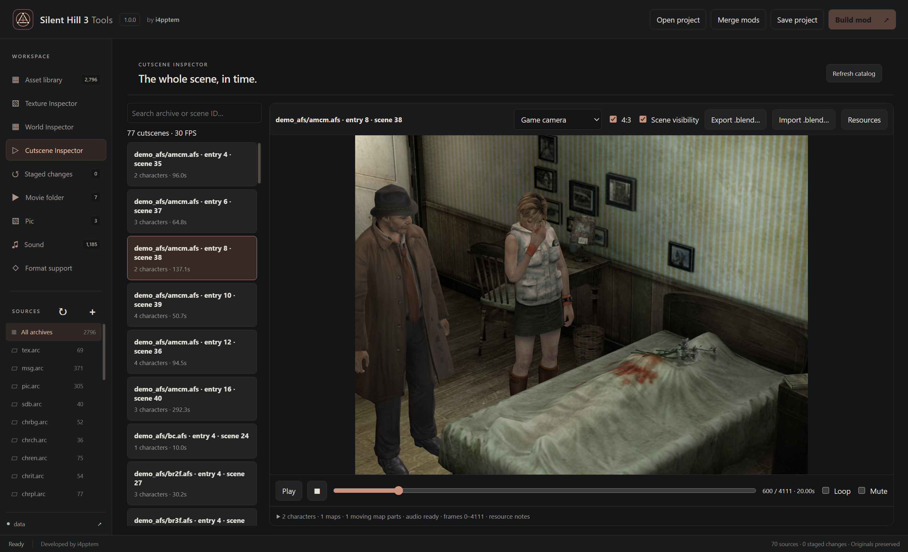

# Cutscene Inspector

Open the complete game **data** folder, then choose **Cutscene Inspector** in the sidebar. This tab plays real-time PACK scenes from the demo AFS archives. FMV files remain in Movie folder.

1. Search by archive name, entry number or native scene ID and select a scene.
2. Press **Play**, drag the timeline, or enable **Loop**. Frame numbering is zero-based and the last frame is included. Camera, skeletons, facial motion and soundtrack share the 30 FPS scene clock. Leaving the tab pauses playback.
3. Switch between **Game camera** and **Free camera**. The 4:3 checkbox preserves the baseline camera framing; turn it off to fill the viewport. In free view, focus the viewport and use WASD, X/C, Shift and right-drag, as in the map viewer.
4. Open **Resources** to choose character variants, a soundtrack from the scene archive, or one or more room maps. Ctrl-click selects multiple maps. **Load resources** reloads the preview. These choices do not stage modifications.
5. **Open** beside a character opens its source model for the existing animation and model exchange tools. **Open PACK source** opens the source entry. After staging asset changes, select the scene again to reload them.

## Resource discovery

The app reads the user's supported PC `sh3.exe` beside `data`; no executable or extracted resource table is bundled. A verified code profile identifies scene descriptors, stage/archive references, model variant paths and background prefixes. Camera coordinates select the existing room MAP using the native indoor grid rule. NPC file paths can override a different MDL header ID when the native loader explicitly names that model. Bone counts still must match.

The tested installation contains **77 PACK scenes**. **72** have verified descriptor-to-audio/environment associations. The remaining five (`culow.afs` entry 14 and `trplatra.afs` entries 8, 9, 11, 12) still load their cameras and characters; choose their soundtrack and maps manually. An absent or unsupported executable also leaves these choices manual.

The standard player costume and the first compatible native NPC variant are defaults. Where the facial payload requires another available variant, its target count participates in selection. The preview cannot infer a costume selected in a running game's save. Resources lists the alternatives explicitly.

## Scope and fidelity

- Camera eye/target, roll and lens projection follow the PC camera adapter, including camera cuts and the final held sample.
- Skeletons use absolute PACK poses and matching facial curves. Duplicate facial controls follow the native first-control rule, including the Douglas scenes. Actor state track zero is not added to bone transforms a second time.
- Heather uses the native detailed body, face, hair and hand part groups during PACK preview, in both viewers. Gameplay duplicates are hidden by their native part IDs, including rebuilt or split meshes. Switching back to ANM or bind pose restores the user's mesh visibility choices. The flashlight and unrecognized scripted parts retain their visibility because PACK does not contain the inventory or complete script state. Exported assets are unchanged.
- Type-2 channels animate matching movable MAP objects and all their material parts. Missing objects are reported.
- ADX playback uses a decoded local cache and supports seeking with the scene. Automatic selection uses the native descriptor, not entry adjacency.
- Light channels are previewed with approximate Three.js lighting. Native attenuation, shadows, particles, fog, postprocessing and stage callbacks are not reproduced exactly. Missing scripted props or visibility may change the appearance.
- **Scene visibility** applies PACK track-8 masks to native type-2 MAP event groups, including all their material parts. Masks are evaluated afresh each frame. Type-3 moving objects retain their separate transforms. Stage scripts can supply additional masks absent from PACK, so some scripted visibility still needs manual scene setup.
- **Export .blend…** exports the selected resources and inclusive frame range together: textured maps, both character skeletal/facial tracks, camera, existing native light channels, moving props, PACK visibility and packed audio. Export starts at Blender frame 0 and uses 30 FPS. Reimport supports existing character/morph, camera, light and moving-object channels at the exported duration. Scene length, actor/channel creation and event scripting remain unsupported. Existing selected-character PACK exchange remains available in the model viewer.

Playback and resource decoding are verified separately from in-game validation of authored replacements. This preview does not connect to or alter a running game.

## Exporting a scene

Load the desired resources, select **Export .blend…**, choose the first and last frame and save to a new file. The current resource choices and Scene visibility setting are used. Blender 4.2+ must be installed. Large scenes are saved directly to disk as compressed `.blend` files, with packed textures and sound; they do not use the individual 256 MiB asset-buffer limit. Long clips can take several minutes because both skeletal and facial motion are baked.

Characters use the authoring bone orientation and preserve original exchange metadata. Secondary MDL materials use alpha blending, including partially transparent lenses. Native light tracks become animated Sun, Point or Spot objects. The background retains its baked vertex colors; it is not a reconstruction of all lights used when the original map was authored.

## Editing and reimporting

1. Export a fresh scene using this version. Older scene files lack the reversible scene-channel metadata.
2. Keep the original game armatures, rest poses, SH3 custom properties, frame range and 30 FPS. Animate bones in Pose Mode; evaluated constraints/IK are sampled. Moving or rotating a character placement also changes its root trajectory. Extra control bones are ignored by the original-bone sampler.
3. Edit the exported camera location, rotation and focal length. `sh3_target_distance` preserves the target distance. Move/rotate **SH3 Prop** empty controllers to animate all matching material parts of a moving MAP object together.
4. Edit a light's location/rotation, color and energy. For point/spot lights, Blender power 1000 represents native RGB intensity 1; Sun power 1 represents intensity 1. This is an authoring convention, not a physical Watts conversion. `sh3_near` and `sh3_far` preserve game attenuation parameters: near = max(0, 50 × near − 100), far = 50 × far. Spot Size and Blend edit the outer cone and soft portion; spotlight target distance and Sun direction magnitude are retained as custom properties. Preserve the original light category and SH3 track identity. Shared map/actor versus actor-only categories are reported on each object, but Blender rendering does not reproduce their native scope exactly.
5. A native morph can drive several meshes. Give the same named key the same weight on every bound mesh. Conflicting or missing facial keys are reported; other components can still be imported with Facial morphs disabled.
6. Save the `.blend`, select the original scene and choose **Import .blend…**. Review changed sample counts, select motion, morphs, camera, lights and/or moving objects, then **Apply & stage cutscene**. Build mod packages the updated PACK in its AFS archive.

The importer checks the source PACK and model revisions before staging. Re-export after replacing the source scene or model. It preserves existing channel descriptors, unselected frames, masks, actor state and unrelated PACK sections. New lights/actors/channels, scene retiming, visibility authoring, geometry/material/audio replacement and stage scripts are not imported by this button; use the appropriate asset workflows. Native attenuation, shadows, particles and postprocessing differ from Blender's renderer. Authored scene replacements require an in-game check.

A native track that ended before the exported range appears at its final pose as a read-only reference. Import does not extend that track or overwrite earlier frames.

## Known stage-script rules

Opaque MAP geometry uses the game's one-sided visibility in preview and scene export. The front face of the parsed triangle winding is visible; scene export preserves that winding and uses single-sided materials. Ordinary editable MAP exchange retains its established triangle order.

- Scene 41 additionally hides event group 4 after applying the PACK mask.
- Scene 65 shows only native groups 0 and 3 for Memory of Alessa, hiding extra weapons.
- Scene 80 reconstructs the carousel's base and satellite rotations, including the speed change after frame 438. The initial phase is not stored in PACK, so preview/export start from zero. Scripted controls are exported for reference and excluded from PACK reimport.
- Scene 48 uses the correct native ADX but starts that audio about 31.5 seconds before PACK motion. Preview skips the lead-in; Blender places the soundtrack earlier on the timeline. Native timing includes a render-tick compensation, so exact synchronization may vary slightly with the game's frame rate.

During export, the modal shows the active stage, measured completed frames where available and elapsed time. Percentage is per stage, not an invented overall estimate. Packing/compression use an indeterminate indicator. Export controls stay disabled until completion; errors restore the controls.
