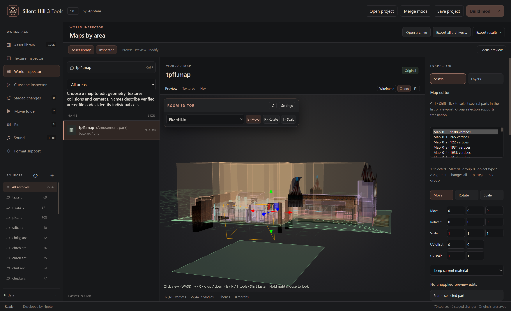

# Map collision and camera zones

## Moving around a map

Click the 3D viewport to give it keyboard focus. **W / A / S / D** fly relative to the camera, **X / C** move up/down, and **Shift** speeds up movement. Hold the **right mouse button** to look around. Left/middle mouse retain the existing orbit/pan controls. Keyboard movement stops when the viewport loses focus. The same navigation works in CLD and CAM previews.

**Ctrl+Z** (Cmd+Z on supported keyboards) works with either Latin or Cyrillic keyboard layouts. In MAP transform fields it undoes the current editing gesture; ordinary text/search fields retain their normal text undo. Staged map actions undo geometry and its bound collision together.

**E / R / T** select Move / Rotate / Scale for the active map, collision or camera target. These shortcuts use physical keys and work with Cyrillic layouts. Typing in ordinary fields keeps its normal behavior.

## Room editor window

The compact **Room editor** sits inside the viewport. Open **Settings** for the **Collisions**, **Cameras** and **Auto rebuild** tabs. Layers are in the right **Inspector → Layers** tab. Drag its header to move it, drag its lower-right corner to resize, or use arrow keys on the focused header/resize handle. **↺** restores the default layout. Position and size are remembered; the active tab and expanded state survive Apply during the current workspace session.

The Inspector retains mesh selection, transforms, texture replacement and map/part import/export. **Apply room**, **Undo** and **Discard previews** remain available at the bottom of the expanded Room editor.

## Overlaying CLD and CAM on a MAP

Select a MAP and open **Inspector → Layers**. Matching CLD and CAM basenames are selected automatically, preferring the same archive. Ambiguous or differently named companions need an explicit choice from the two file lists. A configured collision binding supplies the default CLD. Files come from the open library. Viewing them does not stage a replacement; editing and applying does.

- **Collision layer / Camera zones layer** toggle the two layers.
- **See layers through map** disables depth occlusion for reference geometry; **Layer opacity** adjusts its fill.
- **Collision groups** controls individual CLD groups.
- **Camera study** contains activation/constraint toggles, **Only selected camera zone**, and **Frame selected zone**.

Amber indicates camera activation, blue its constraint geometry. For anchored modes 6/7, the blue cross marks the stored camera position. Flat constraints appear as outlines and line constraints as lines. A displayed CLD whose native header disables it is labeled accordingly.

The layers combine current staged files with unapplied room drafts and refresh after apply/undo. Unapplied mesh transforms do not rebuild a bound CLD until **Apply & stage map edits**. Reference geometry cannot be selected as a MAP mesh and is never included in MAP GLB exports or native edits. Layer visibility, chosen files and study settings last for the current workspace session; they are not saved in `.sh3project`.

### Looking through a camera

Open **Cameras → Camera study**, select a zone and enable **Show camera view**. The smaller view remains independent of map navigation. Use **Move reference with gizmo** to drag the character along an axis or plane. **Place reference on map** positions it by clicking a surface; numeric **Reference position** remains available in native coordinates. Click the placement button again to cancel. **Center reference in zone** is a useful starting point; it does not snap to a floor. Adjust **Facing °** (0 points along native +Z) and **Reference height** to study tracking.

The wire figure is a reference marker. Its default height, 835 native units, is the camera controller's subject-top offset, not a measured model height. The status lists every activation volume containing the reference. **Zone selection is manual** because actual switching also uses priorities, previous state and gameplay logic.

| Movement mode | Camera study |
| --- | --- |
| 0 · Follow | Approximate tracking with default subject height and road margin |
| 2 · Fixed angle | Stored sight angles with a representative static camera position |
| 6 · Anchored tracking | Stored camera position with an approximate tracking target |
| 7 · Anchored fixed angle | Stored camera position and pitch/yaw; nonzero roll is reported as excluded |
| Other modes | Reference geometry remains available; no fabricated camera view |

This is a **composition reference**, not a full gameplay-camera emulator. Native startup constants are decoded on a copy, and projection is converted from the game's virtual-screen focal length. The view uses a baseline 4:3 composition. Previous-camera motion, collision avoidance, smoothing, look/enemy controls, zone transitions, vertical controller history, stage-specific overrides and resolution/widescreen changes are omitted. Check final behavior in the game. Using the study does not stage or write any asset.

## Editing collision and cameras inside the map

Click a visible collision or camera surface directly to select it and open its Room editor tab. **Pick visible** selects the nearest visible MAP/CLD/CAM geometry; **Meshes only**, **Collisions only** and **Cameras only** resolve overlapping layers explicitly. You can also select records in **Collisions** or **Cameras**, then use **E · Move**, **R · Rotate** or **T · Scale**. **Return to map meshes** restores MAP selection. **Frame selected record** centers the view.

For CAM, choose **Activation volume** or **Camera constraint / sight direction**. In fixed-angle modes **2/7**, choose **Rotate view** to change pitch/yaw with the gizmo, or enter **Pitch ° / Yaw °** under Camera behavior. This changes the sight direction while retaining activation/constraint bounds, offsets, distance and native roll. Anchored modes 6/7 expose their camera point as a translation target; mode 6 tracks the subject and has no independent sight-angle rotation. Activation volumes still support rotation around Y. The camera study follows the edited zone and updates immediately; its existing runtime/roll preview limitations remain.

For CLD, choose **Connected surface** (default viewport picking), **Single face** or **Whole native group**. Connected surfaces share complete edges within the same native group; touching corners alone do not join them, and cylinders remain individual records. **Shift-click** adds to the viewport selection; **Ctrl-click** toggles it. The list supports Shift ranges and Ctrl selection. **Select connected**, **Select group** and **Select all** expand the list selection. Selected records are highlighted. **Move**, **Rotate** and **Scale** act on all selected records around their shared bounding-box center, including selections across groups, with one Ctrl+Z undo per gesture. Position fields translate the whole selection. Per-surface material/behavior properties require a single record. These groups are editor selections because CLD stores polygons rather than named obstacles. Surface properties expose the native material ID; cylinders also expose radius and absolute top Y. Vertical walls must remain rectangular. Floors and ray surfaces support XYZ rotation. A selection containing native walls or cylinders rotates only around Y so these shapes remain upright. Cylinder X/Z scale changes its radius equally on both axes; Y scale changes its height. Native top Y and radius remain individually editable. Spatial lists rebuild on Apply. Record counts and native behavior metadata are retained.

All three layers share unapplied room drafts and **Ctrl+Z**, including focused position/property fields. **Apply room** or **Apply & stage map edits** stages all current room drafts atomically. **Discard preview edits** clears all of them. Drafts survive navigating away and back. Saving a project validates and stages pending rooms atomically; building requires Apply or Discard first and lists pending rooms in Build review. Reference-character movement is only a study setting and never changes CAM/CLD bytes. If Apply fails, its exact reason stays next to the pending-edit count. Build lists the affected room names and that reason. Correct or undo the offending edit, then Apply again; edits in other rooms must also be applied or discarded. Validation failure stages none of that room transaction and retains its previews.

Generated collision groups follow their source MAP meshes. To edit their CLD records manually, use **Auto rebuild → Stop auto rebuild · keep collision** first; this retains the current geometry. Manual edits to other groups become part of the binding's base and survive future regeneration and project reload. A CLD bound to another MAP must be edited from that owner.

## Expanded geometry and larger textures

Moving or importing static type-1 geometry beyond its original envelope changes only that part to native type 0 (unpartitioned visibility). Its base transform, materials and identity remain intact; the original grid anchor and other parts are untouched. This increases draw work for the expanded part while the MAP is loaded. It does not load neighboring rooms, change events or partition a mesh into optimized cells. Type-2 event objects and type-3 movable objects retain the existing bounds checks. Verify camera turns and room transitions in the game.

For **Selected material texture**, choose **Fit to original** or **Full size · checked room memory**. Full size preserves PNG dimensions and rebuilds direct-color storage. Texture Inspector supports the same operation for terminal embedded MAP batches and shared GB/TR images. Shared edits affect every referencing map. Custom MAP files with data after the texture batch support Fit only.

Open the complete data folder for resource growth. The validator includes staged MAP/CLD/CAM and companion files, native file/category alignment, shared textures, the demo reservation, and the two largest distinct room footprints in an indoor stage. When the original 36 MiB primary background arena is insufficient, Build mod requires the conditional 256 MiB background patch. Outdoor `cc` growth is checked against the partial-streaming tile budget; unsupported or oversized combinations are rejected. A 2K texture can legitimately exceed a room/stage budget even though its image dimensions are supported by the loader.

## Binding collision to selected map meshes

1. Open the game's data folder or the room archive, then select its MAP.
2. Select the meshes that should form a collision group. Ctrl/Shift-click selects several parts. Use simple geometry for collision; decorative faces should not all become solid.
3. Open **Room editor → Auto rebuild**. Choose **Collision source meshes** directly or click **Use Inspector mesh selection**. The matching CLD basename is selected when available; otherwise choose the correct CLD explicitly.
4. Choose the group: **Floor**, **Walls**, **Other surfaces (rays)** or **Special walls**. Expand the advanced settings to choose the native material ID and behavior-template polygon. Material IDs are gameplay surface flags, not MAP texture slots. A previously empty group uses the verified standard native header.
5. Click **Enable auto rebuild** (or **Update binding & rebuild** for an existing binding). This **replaces every polygon in the chosen group** with collision from the selected meshes. It does not infer which original colliders belonged to those meshes. Other groups, cylinders, file origin and opaque metadata remain intact. Repeat for another group if needed.
6. Apply map transforms, import a whole replacement MAP GLB or replace a selected mesh, including new topology. Whole-map imports must preserve the bound mesh names. The bound CLD rebuilds automatically before either file is staged. **Ctrl+Z** restores the MAP and CLD together.
7. Save the `.sh3project` to retain the mesh bindings, then **Build mod**. Both replacement-file and ASI-overlay builds include the rebuilt CLD in its archive.

**Stop auto rebuild · keep collision** disconnects the binding while retaining the generated geometry. The advanced **Restore original collision & disconnect** action restores the collision bytes from before the binding was created. Undo restores either operation. Compatible bindings survive source reload after installing a build; conflicting source changes are reported for review. If the CLD is changed separately, automatic rebuilding stops with a conflict rather than overwriting that work.

### Native collision rules

- Room collision uses list 0. Outdoor collision uses a 4 × 4 grid of 5,000 native units per cell. The initial setting follows the existing CLD; the override must match the game's location. Changing this setting does not convert an indoor stage into an outdoor stage.
- Floors and other ray surfaces support triangles. Native plane winding is rebuilt from the render surface's orientation. Degenerate and duplicate faces are removed; the triangle's fourth stored corner repeats its first.
- Character collision against walls uses vertical spans, not arbitrary triangle geometry. Coplanar render triangles are merged into vertical rectangles. Unsupported sloping/irregular wall surfaces are rejected with the affected mesh name. Long outdoor walls are divided at grid lines, and spatial lists use projected polygon intersection.
- Outdoor geometry must stay inside the original 20,000-unit square. The original origin remains fixed.
- This feature does not expand engine limits. The native wall-contact buffer holds 32 simultaneous results; use uncomplicated wall geometry and test corners and overlapping barriers in gameplay. Collision should not be a high-resolution copy of decorative render geometry.
- CLD has no separate 48/64 KiB allocation limit. Its size shares the background loading budget with MAP, textures, cameras and other room resources. The vanilla primary budget is 36 MiB; outdoor tile allocations are smaller and share common resources. The writer rejects a CLD that alone exceeds the entire room/tile upper bound, and the complete-catalog validator additionally checks indoor shared resources and the two largest room footprints together. Outdoor budgets reserve four tile fractions, each at least twice the largest tile, plus common resources. When the stock pool is insufficient, the conditional 256 MiB background extension is required. The auxiliary pool remains 12 MiB.

Expanded static MAP parts use the native unpartitioned rendering category while the room remains loaded. Other parts retain their cell mapping; event-controlled and movable parts retain their ownership and bounds. Collision binding does not modify portals, triggers, scripts, navigation or room streaming. Test authored maps in-game, especially room transitions and edges. Edits within stock memory need no new patch; growth beyond it conditionally requires the background extension.

## Editing `.cam`

CAM contains gameplay camera zones. It is separate from PACK cutscene camera tracks.

Select a CAM asset and choose a **Camera zone**. Amber geometry shows its activation region; blue geometry shows the camera constraint region. **Show other zones** reveals the other records. Edit three X/Z ground corners and the two native Y height bounds, then choose **Apply & stage camera zone**. The fourth ground corner is derived from the three stored points. **Frame camera zone** focuses the current pair of regions.

**Camera behavior** exposes IDs, flags, projection values and mode-specific parameters. Preserve unknown flags and values. Angular parameters use native radians; projection values are not labeled as FOV degrees. PC camera modes extend beyond the original shared mode table. Their four parameters have different meanings; preserve parameters for modes that are not understood:

| Mode | Parameters 1–4 |
| --- | --- |
| Chase | Height offset, XZ radius ratio, left yaw limit, right yaw limit |
| Fixed-angle (2) | Pitch, yaw, subject-top offset, camera-to-watch distance |
| Circle | Origin X, origin Z, yaw, radius |
| Anchored fixed angle (7) | Pitch, yaw, roll; fourth value is unused by the sight-direction calculation |
| Other modes | Retained native parameters; not a general-purpose position/rotation array |

**Export structure JSON** and **Import camera structure JSON…** provide bulk editing. Keep the original record count and indices. The writer retains ordering, the complete end-marker record and trailing bytes; flag bit 0 is reserved for that marker. Undo restores the prior staged CAM. Build mod writes the modified camera asset into its archive.

The standalone CAM editor displays volumes. MAP reference layers additionally show fixed camera points and offer the camera study described above. Changing camera behavior still requires checking the affected room in the game.

## Collision complexity

New automatic bindings default to **Simplified · recommended**. The simplifier welds rendering seams, removes redundant triangles and preserves topology, disconnected obstacles and openings. Floor bindings default to **Walkable faces only** (upward faces up to 60°); other surface groups use all selected surfaces. Upright wall groups continue to merge coplanar faces into native rectangles.

Use **Preview complexity** before enabling a whole-room binding. It shows the generated polygon count beside the original group. **Surface rules & original collision** exposes **Shape tolerance** (default 20 native units) and **Target triangles** (default twice the original polygon count, minimum 8). The target is a goal, not a forced cap: shape error, openings and topology can require more faces. Select only solid meshes; decorative geometry is not automatically understood as non-colliding.

**Full source detail** retains all supported source surfaces. Existing saved bindings keep their old settings; select Simplified and **Update binding & rebuild** to adopt reduction. Save the project to retain the chosen quality and surface rules. Undo restores the previous collision and binding together.

Read-only generation checks using every visual mesh reduced `am11` floor triangles from 13,733 to 228 and `tpf1` from 22,107 to 859 with the recommended settings. This is a geometry-count comparison, not a game performance measurement or a promise that all decorative surfaces should collide. Review the CLD overlay and test movement, edges and corners in the game.

## Geometry growth

Both opaque and transparent parts support new topology within the editor's existing per-part/file and stage-memory budgets. Build mod conditionally adds the [transparent queue preflight patch](EXECUTABLE-PATCHES.md#map-geometry-queue) when that geometry grows. Opaque MAP vertex counts are already 32-bit. Large geometry and transparent ordering still need an in-game test.
